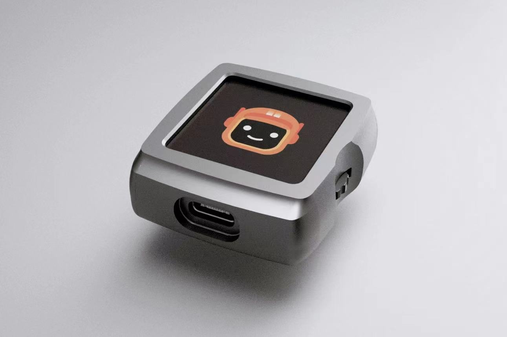
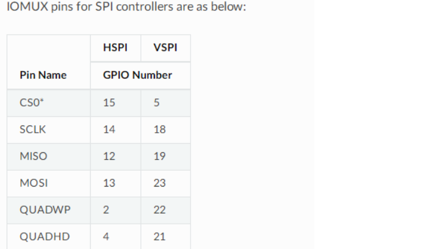

## 说明



> 本项目是一个超迷你的智能小终端，集成LVGL图像框架、MVC框架、消息框架、WiFi蓝牙能力，未来会加入触摸屏支持。可以作为智能控制器用于实现很多应用。
>
> 另外我正在上面实现一个非常小型的3D引擎，可以用于动态显示一些3D模型（就像Dummy示教器中展示的那样）。

非常感谢 https://github.com/FASTSHIFT 开源的X-Track项目，本文是对于X-Track硬件和固件往ESP32平台移植的记录说明。

## 1. 硬件移植

### 关于芯片选型

主要考虑MCU的Flash、SRAM、SPI速度，需要满足以下要求：

* 主频 > 150MHz
* RAM >= 200KB
* FLASH >= 512KB
* SPI速度 >= 50Mbps（60fps刷新率的要求）

> lvgl中需要设置LCD buffer，一般设置为屏幕分辨率大小，在本项目中为240x240x2（因为是16bit色深所以每个像素2字节），算下来至少需要112KB的SRAM。
>
> SPI的CLK速度计算如下：240x240x2x8x60=55.296MHz，因此最好是达到50MHz以上的频率才能保证刷新流畅（实际上不使用DMA传输数据的话帧率会更低）。

经过筛选满足以上要求的MCU，综合考虑成本和购买渠道问题，除了官方项目使用的雅特力AT32F403ACGU7主控外，还有两款是比较合适的：STM32F405RGT6、ESP32。

**对比优缺点如下：**

* STM32F405的主频不如ESP32高且后者为双核；
* 外设方面STM32F405更丰富，也支持使用DMA+SPI驱动屏幕；
* ESP32带WiFi能力，STM32不带；
* ESP32可以直接基于Arduino生态开发，而STM32一般基于HAL库，移植Arduino较麻烦；
* STM32可以使用ST-Link方便调试而ESP32只能通过串口打印log调试。

最终选择**ESP32-PICO-D4**作为移植MCU方案。

## 2. 固件移植

原工程的架构分层设计比较合理，整体软件架构如下图所示，系统由 HAL、Framework 和 APP 三层组成 ：


### LVGL 和页面调度

LVGL是开源的嵌入式图形库，其广泛应用嵌入式 GUI 中，提供了基础控件和底层图形渲染能力。

X-TRACK 使用 LVGL 作为图形库，提供用户显示界面，并使用了许多 LVGL 提供的基础控件。例如在地图页面的轨迹显示中使用了 line 控件，地图显示使用了 image 控件，在表盘页面的页面切换选择，使用了 button 控件。由于 LVGL 自带页面管理功能较弱，需要规范页面行为，便于对页面生命周期进行管理。

页面调度器参考 **IOS ViewController** 进行设计，页面生命周期管理流程图如下：


根据页面当前状态，对页面动作进行管理。例如地图页面的加载，在执行 onViewLoad (页面开始加载)时初始化视图和数据；在 onViewDidAppear（页面即将显示） 执行过渡动画，在动画结束时显示地图容器。

在有外部按键事件触发后，依次执行onViewWillDisappear(页面即将消失)、 onViewDidDisappear （页面消失完成）、onViewDidUnload（页面卸载完成）。

### 消息框架

消息框架提供数据的分发和处理。其使用订阅发布机制完成，将 HAL 层的接收到的传感器数据发布，转发给对应的订阅者进行数据处理。

以 GPS 为例，GPS 数据处理节点每秒读取一次卫星数据，然后发起 publish ，由消息框架将 GPS 数据推送给订阅者。在运动数据处理节点中订阅 GPS 数据。在收到 GPS 数据之后，运动数据处理节点根据 GPS 数据计算总里程，平均速度等信息。在表盘页面中，拉取运动数据节点信息，将其显示在表盘页面中。

比如下图为 GPS 数据事件回调函数:


### 屏幕移植

具体移植步骤为：

1. 将LVGL（使用版本为`v8.1`）的相关port函数移植到新平台（显示、文件、输入）
2. 实现HAL层的各个文件

> 其中第一步中SD卡文件系统的移植遇到问题是用SD库可以读写，而LVGL的文件操作函数不行，后发现原因是`lv_port_fatfs.cpp`文件中的`lv_fs_drv_t fs_drv`变量需要改为全局/静态变量，原工程中在函数中声明static在CLion编译器下似乎不起作用。

显示的移植涉及到几个配置文件:`Config.h` 、`lv_conf.h`、`User_Setup_Select.h`（`Setup24_ST7789.h`）

首先根据屏幕型号使用`TFT_eSPI`库驱动测试好硬件。

> TFT_eSPI库速度比其他库快，而且其数据类型和LVGL无缝对接。

这个项目中选择`Setup24_ST7789.h`这个配置文件，除了**GPIO**、**屏幕反向**、**像素顺序**设置正确之外，`SPI_FREQUENCY`也是一个很重要的参数，如前面所计算的，为了是的屏幕刷新率达到60Hz，需要设置这个频率高于50MHz。

然而，对于ESP32来说，其具有2个可用的硬件SPI：**HSPI**和**VSPI**。

> SPI0是专用于Flash的缓存，ESP32将连接的SPI Flash设备映射到内存中；SPI1和SPI0 使用相同的硬件线，SPI1用于写入flash芯片。
>
> VSPI是默认的SPI总线，要使用HSPI的话，**需要修改以下代码中的MISO为26**：
>
> ```
>  if(sck == -1 && miso == -1 && mosi == -1 && ss == -1) {
>      _sck = (_spi_num == VSPI) ? SCK : 14;
>      _miso = (_spi_num == VSPI) ? MISO : 12; // 需要改为26
>      _mosi = (_spi_num == VSPI) ? MOSI : 13;
>      _ss = (_spi_num == VSPI) ? SS : 15;
> ```
>
> 这是因为，HSPI的默认MISO引脚是12，而12在ESP32中是用于上电时设置flash电平的，上电之前上拉会导致芯片无法启动，因此我们将默认的引脚替换为26或其他引脚。

由数据手册可知，ESP32的SPI时钟是由80MHz的`APB_CLK`时钟信号分频而来，因此最高支持的频率为80MHz，如果分频的话，库函数会自动选择分配系数来获得最接近于设定频率的整数倍系数。

> **注意**，只有在使用IOMUX时才能获得最高的SPI频率，如果SPI采用GPIO矩阵，则最大频率会限制在26.6MHz。
>
> IOMUX指的是不使用IO-Matrix的映射功能，而是使用默认的MISO、MOSI、CLK引脚，也就是如下图：
>
> 

屏幕驱动验证完成后，配置LVGL的相关初始化函数，其中`lv_conf.h`的配置有几点值得注意的：

* **LV_MEM_SIZE的设置**

  在Arduino环境中LVGL默认定义LV_MEM_CUSTOM=0，即不使用标准库中的*malloc*等内存分配函数，而是封装了一个*lv_mem_alloc()*函数用于内存申请。这个函数的原理其实是**先在编译的时候申请一块`LV_MEM_SIZE`大小的数组内存，然后在后面使用*lv_mem_alloc()*函数的时候，从这块内存中进行分配。**

  因此，`LV_MEM_SIZE`设置的内存大小是在bss段分配的，**这个数值设置过大的话会导致编译链接阶段报错内存不足。**

  > 经测试设置16K就足够了，因此代码中该值为`(16 * 1024U)` 。
  >
  > 如果想在后面屏幕buffer中使用这块内存进行分配，那就需要设置大一点，但是ESP32的Arduino框架中对于申请静态内存的尺寸有限制，因此我们并不使用这里的内存，而是到时候用*malloc()*函动态数申请。

* **`lv_disp_draw_buf_init`函数中的屏幕buffer设置**

  这个buffer可以设置为单buffer或者双buffer，但是双buffer只在使用DMA传输数据的时候可以起作用（刷新缓存和传输数据并行），因此这里只用单buffer。

  理论上buffer的尺寸等于屏幕分辨率是最理想的，可以保证一次刷新整个屏幕，~~但是由于ESP32的内存大小限制，本代码中最大只能设置为屏幕分辨率的一半。~~

  > 最早HoloCubic的代码中并未注意到这一设置，buffer只设置为了240x10，因此导致画面刷新缓慢且有撕裂感。
  >
  > 关于ESP32内存申请的限制，由于能用的内存实际只有大概300KB，而屏幕完整buffer需要112KB，因此很难在内存中找到连续的那么大片空间，~~经测试不管是用静态变量申请还是malloc动态申请，都无法成功，因此只能设置为一半大小的buffer。~~
  >
  > 在ESP32-PICO-D4上测试发现，如果新建空白工程再用`ESP.getMaxAllocHeap()`，得到的可用空间是略大于115200B的，但是加入`lvgl_init()`代码之后就不足115200了，因此修改`lvgl_init()`函数代码，把`lv_mem_init`函数中static 变量申请的内存改为动态malloc，即可解决buffer问题。
  >
  > 引起该问题的原因是，ESP32有多块内存可以映射为dataRAM，总大小是300KB左右，但它们之间是不连续的，最大的一块刚好略大于115200。如果在代码中事先编译的时候分配内存占用了这一块（声明了static变量），或者运行的时候在LVGL申请屏幕buffer之前先被其他地方申请了该块内存导致连续可用heap小于115200，那么屏幕buffer就无法申请成功。因此解决方案是先在代码中将这块最大的heap申请下来给屏幕buffer，再运行其他初始化代码即可完美解决。
  
  关于ESP32的内存模型更多信息，可以参考文章末尾链接的几篇文章分析。
  
  

## 参考链接 

* [LVGL](https://github.com/lvgl/lvgl)
* [Bing Maps Tile System](https://docs.microsoft.com/en-us/bingmaps/articles/bing-maps-tile-system?redirectedfrom=MSDN)
* [IOS ViewController](https://developer.apple.com/documentation/uikit/uiviewcontroller)
* [ESP32之软件SPI驱动及SPI、HSPI和VSPI的理解](https://blog.csdn.net/jdsnpgxj/article/details/100013357)
* [ESP32 程序的内存模型](https://zhuanlan.zhihu.com/p/345915256)
* [Heap Memory Allocation](https://docs.espressif.com/projects/esp-idf/en/latest/esp32/api-reference/system/mem_alloc.html)
* [Error: region `dram0_0_seg' overflowed by 31632 bytes](https://www.esp32.com/viewtopic.php?t=7131)
* [[ESP32] ld: region `dram0_0_seg’ overflowed by 156768 bytes](https://community.platformio.org/t/esp32-ld-region-dram0-0-seg-overflowed-by-156768-bytes/18753)